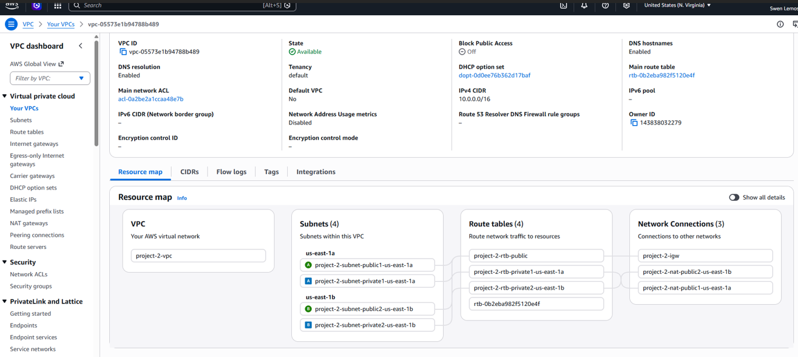
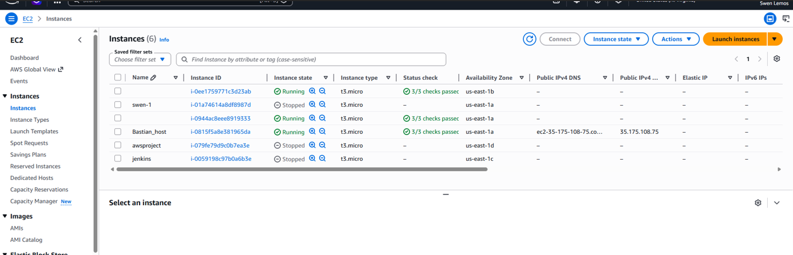
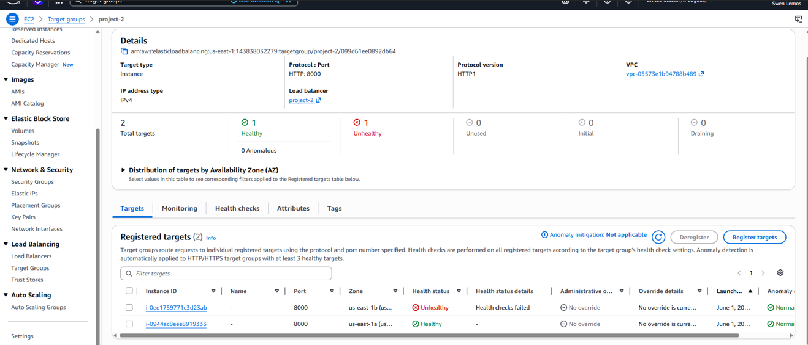
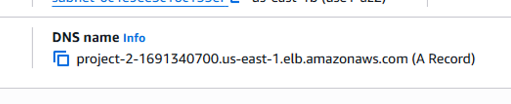
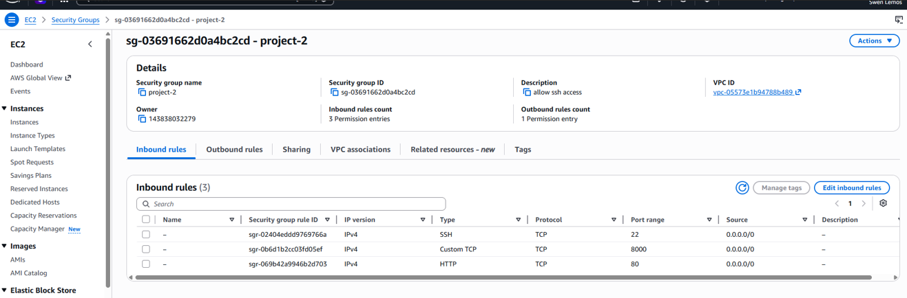
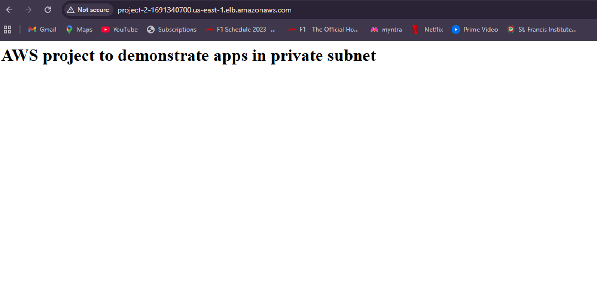

# Secure High Availability AWS Architecture

## Project Overview

This project demonstrates the deployment of a secure and highly available AWS infrastructure using Amazon Web Services (AWS).

The architecture was designed using a custom Virtual Private Cloud (VPC) with public and private subnets. A Bastion Host was used to securely access resources inside the private subnet, while an Application Load Balancer (ALB) distributed incoming traffic to backend instances.

---

## AWS Services Used

* Amazon VPC
* Amazon EC2
* Security Groups
* Bastion Host
* Target Group
* Application Load Balancer
* Ubuntu Linux
* Python HTTP Server

---

## Architecture Flow

```text
Internet User
      │
      ▼
Application Load Balancer
      │
      ▼
Target Group
      │
      ▼
Private EC2 Instance

Administrator
      │
      ▼
Bastion Host
      │
      ▼
Private EC2 Instance
```

---

## Implementation Steps

### Step 1: Create VPC

* Created a custom VPC
* Configured networking components
* Created public and private subnets

### Step 2: Configure Security Groups

* Allowed SSH access for Bastion Host
* Allowed HTTP access through Load Balancer
* Restricted direct access to private instances

### Step 3: Launch EC2 Instances

* Bastion Host in Public Subnet
* Application EC2 Instance in Private Subnet

### Step 4: Connect to Private Instance

Connected to Bastion Host using PuTTY and then connected to the private EC2 instance using SSH.

```bash
ssh ubuntu@<private-ip-address>
```

### Step 5: Configure Target Group

* Registered EC2 Instance
* Verified target health status

### Step 6: Create Application Load Balancer

* Created ALB
* Attached Target Group
* Generated public DNS endpoint

### Step 7: Deploy Application

```bash
echo "<h1>AWS Architecture Project</h1>" > index.html
python3 -m http.server 8000
```

### Step 8: Verify Deployment

Opened the Load Balancer DNS endpoint in a browser and successfully accessed the application.

---

# Screenshots

## VPC Resource Map



## EC2 Instances



## Target Group Health



## Load Balancer DNS



## Security Groups



## Browser Verification



---

## Skills Demonstrated

* AWS VPC
* Public and Private Subnets
* Security Groups
* Bastion Host
* SSH Connectivity
* Application Load Balancer
* Target Groups
* Linux Administration
* Cloud Networking
* AWS Security Best Practices

---

## Author

Swen Lemos
